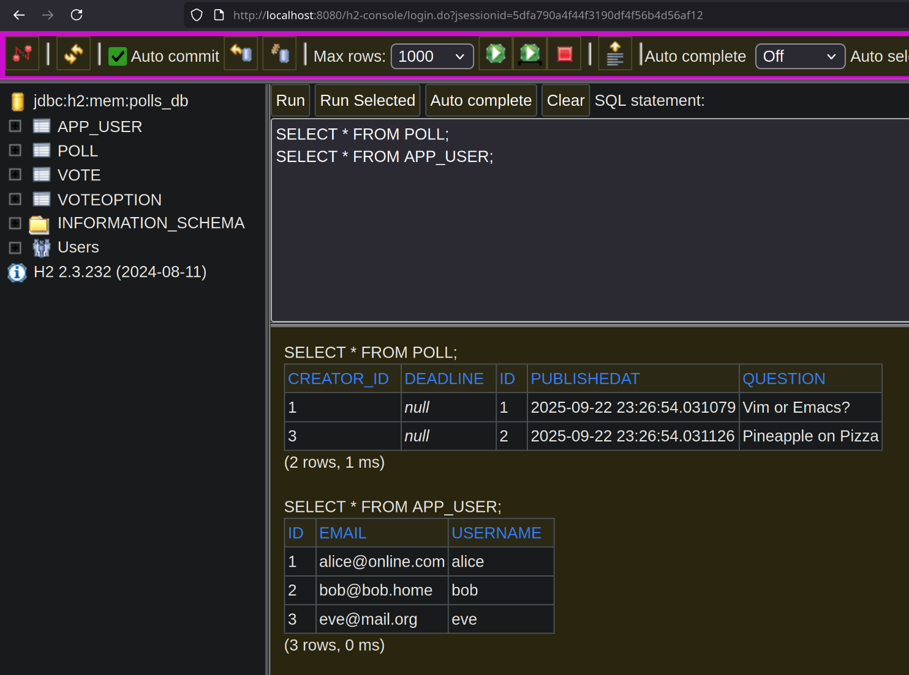

# DAT250: Software Technology Experiment Assignment 4

https://github.com/olefb/pole

## Introduction

`PollsTest` succeeds and showcases how the Jakarta Persistence API (implemented in Hibernate) can be used to work with model objects. After getting the tests to pass by adding lacking methods, I adapted the test methods to run on the main application class. I set up access to the in-browser H2 console, in which I could handle the database and verify that objects had been created in the in-memory database. Here's a screenshot of it in use:

## Technical issues encountered

* My system updated my Java version from 24 to 25, causing Gradle 8.x to no longer work. I had mistakenly thought 24 was an LTS version (25 is). I had to update Java SDK settings and set the Gradle version to 9.x to fix this.

* I couldn't figure out what the `created` variable in `User` was meant for, so I removed it.

* Some of the tests used table names that didn't match the contents of my models that previously had table annotations, so these had to be updated to correlate.
