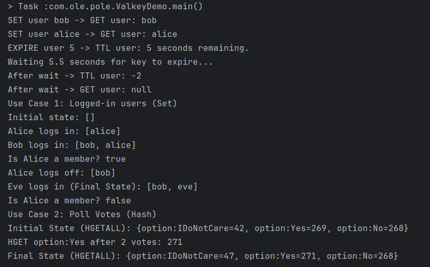

# DAT250: Software Technology Experiment Assignment 5

https://github.com/olefb/pole

## Introduction

This experiment integrated Valkey (using the `valkey-java` library) into the voting application, `Pole` to implement a high-performance, real-time vote counter cache for poll results. The goal was to eliminate the need for an "expensive" SQL query to aggregate vote counts from the main relational database on every poll results retrieval.

The choice was made to use Valkey as it was the simplest to install on my system (running Arch Linux). The initial "use cases" were experimented with in the CLI, and then implemented as a self-contained Java application in the project (`ValkeyDemo.java`):



Next, the caching system was implemented in the main project. A new REST endpoint was added for the vote results at /polls/{id}/results and tested using Swagger. With the Valkey server running locally, the cache was populated when a poll was voted on, with a 1 hour TTL.

Here is the Valkey output after adding a poll with ID 1, with 3 votes for option 1 and 1 vote for option 2.

```
127.0.0.1:6379> HGETALL poll:votes:1
1) "1"
2) "3"
3) "2"
4) "1"
```

## Technical issues encountered

* Configuration issue: `Could not resolve placeholder 'valkey.host' in value "${valkey.host}"`. Solved by adding this and `valkey.port` properties to the `src/main/resources/application.properties` file.

* JMX Mbean issue: `UnableToRegisterMBeanException: MXBean already registered with name org.apache.commons.pool2:type=GenericObjectPool...`. Solved by disabling JMX within the `ValkeyConfig.valkeyJedisPool()` method.
