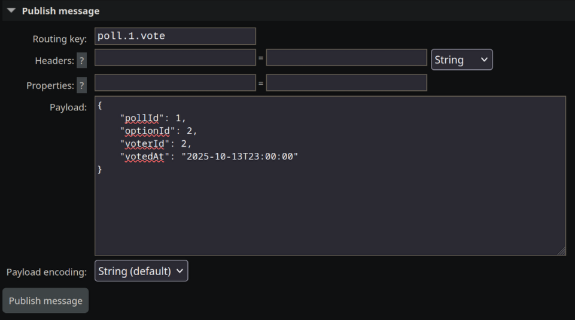
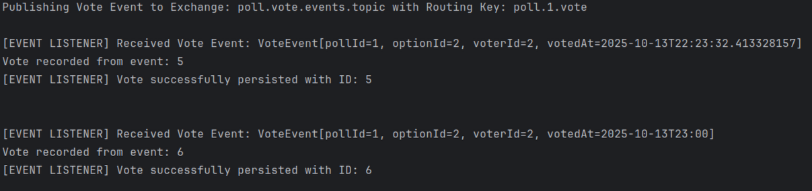

# DAT250: Software Technology Experiment Assignment 6

https://github.com/olefb/pole

## Introduction

This assignment focused on introducing event sourcing and message brokering to the `Pole` application using RabbitMQ (via Spring AMQP). The primary goal was to decouple the user-facing voting API from the core state update logic, transitioning the application towards a more scalable, event-driven architecture.

The core idea was to treat a vote not as a direct database transaction, but as an immutable event published to a message broker. The application then listens asynchronously to these events to update its data stores (in-memory HashMaps and Valkey cache).

RabbitMQ was installed from the OS repository and run as a system service.

### Implementation Details

* **RabbitMQ Configuration:** A central `TopicExchange` named `poll.vote.events.topic` was used to register all poll updates.
* **Publisher:** The `PollController` and `PollManager.createVote` method were modified to stop persisting the vote directly. Instead, they serialize the vote into a `VoteEvent` DTO and publish it to the exchange with a specific routing key, `poll.<pollId>.vote`.
* **Listener:** The `PollApp` itself was configured with a dedicated queue (`poll-app.listener.queue`) bound to the pattern `poll.*.vote`, allowing it to subscribe to all vote events across all polls. A new `@RabbitListener` handles the asynchronous consumption of these events.
* **State Update:** The listener calls `PollManager.recordVoteFromEvent`, which asynchronously updates the application's state (in-memory data and the Valkey vote counter cache).

The final setup was tested by observing the asynchronous event flow in the application logs:

## Test 1: REST API publishes event
Publishing vote event to exchange: poll.vote.events.topic with Routing Key: poll.1.vote in the RabbitMQ admin panel:




## Test 2: RabbitMQ listener processes event asynchronously

```
curl -X POST http://localhost:8080/votes \
      -H "Content-Type: application/json" \
      -d '{
      "voterId": "2", 
      "optionId": 2, 
      "pollId": 1
  }'
```

Output:

```
[EVENT LISTENER] Received Vote Event: VoteEvent[pollId=1, optionId=1, voterId=1, votedAt=...]
Vote recorded from event: 5
[EVENT LISTENER] Vote successfully persisted with ID: 5
```

IntelliJ log output:



## Technical issues encountered

* **Race condition / Data mismatch at startup:** The primary issue encountered was a race condition during application startup. The RabbitMQ listener connected and began processing stale messages from the queue (from previous tests) before the application's core data (`users`, `polls`, `options` in `PollManager`'s HashMaps) was fully initialized by the `PollsDataInitializer`. This resulted in `Event data invalid: User, Poll, or Option not found.` errors for the first few events. This timing issue was compounded by the fact that the `PollsDataInitializer` was originally designed to use JPA/H2, while the application's actual runtime persistence was via in-memory HashMaps in the `PollManager`.
* **Solution:** The `PollsDataInitializer` was refactored to remove all JPA dependencies. It now uses the `PollManager`'s persistence methods (including the new `recordVoteFromEvent`) directly and synchronously via the `CommandLineRunner`. This guarantees that all required entity IDs and map entries are fully populated before the asynchronous listener thread can successfully process any events, resolving the startup race condition.
